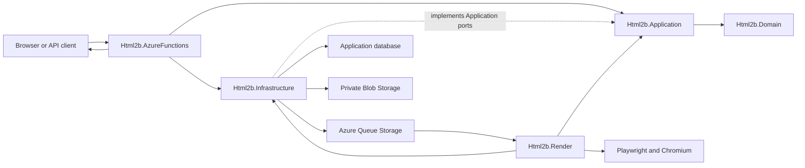
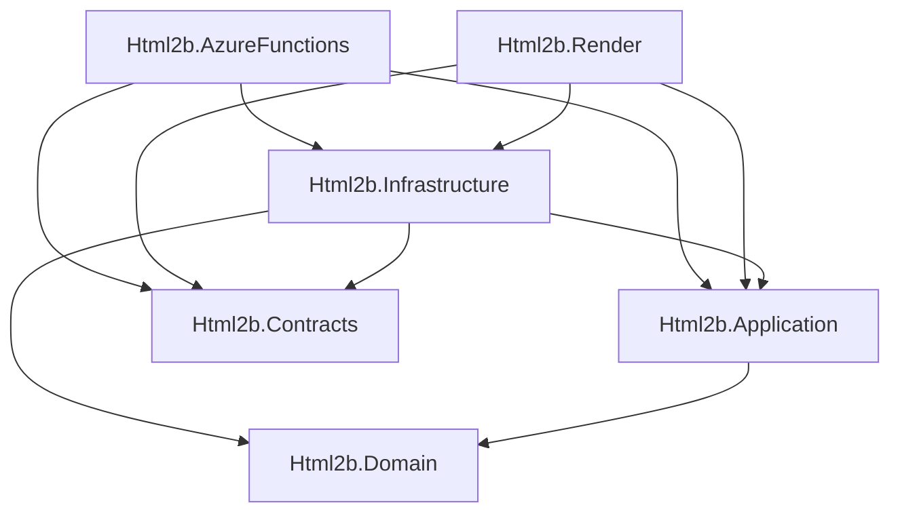

# Html2B API Architecture

## Status and scope

This document defines the target source and deployment architecture for the
Html2B API, template-management capabilities, and asynchronous rendering
pipeline. The six production project boundaries now exist, but the durable
queue, persistence, and target Azure topology remain future work.

The current Feature 003 proof of concept runs `Html2b.AzureFunctions` as the
public .NET isolated Functions host and `Html2b.Render` as a loopback-only
ASP.NET Core Minimal API container. `Html2b.Infrastructure` calls Render through
an explicitly transitional private HTTP bridge that carries only a versioned
format request and returns a bounded raw file response. The hardcoded HTML,
Playwright, Chromium lifecycle, and output metadata are owned by Render. No
queue, Blob Storage, database, or durable render job exists yet.

## Repository layout

```text
docs/
  api/
    architecture.md

src/
  api/
    Html2b.slnx
    Html2b.AzureFunctions/
    Html2b.Render/
    Html2b.Domain/
    Html2b.Application/
    Html2b.Infrastructure/
    Html2b.Contracts/

    Test/
      Html2b.AzureFunctions.Tests/
      Html2b.Render.Tests/
      Html2b.Domain.Tests/
      Html2b.Application.Tests/
      Html2b.Infrastructure.Tests/

  ui/
    # Future Angular application

bicep/
  # Azure resource definitions and environment parameters
```

Only the six production projects are currently present. The test layout shown
above remains the target; Feature 003 intentionally added no test projects.

The production projects form one modular backend with two deployable hosts:

- `Html2b.AzureFunctions` is the public control-plane host.
- `Html2b.Render` is the private render host. Its Feature 003 Minimal API is
  temporary; the target host is queue-driven.
- `Html2b.Domain`, `Html2b.Application`, `Html2b.Infrastructure`, and
  `Html2b.Contracts` support both hosts but are not deployed independently.

Do not split template, asset, account, and render-job capabilities into
separate deployed microservices without a measured need. Their ownership
should first be expressed as modules and use cases inside this structure.

## Target system overview

Html2B is a template-rendering platform. An authenticated user or API client
manages reusable templates and assets through the Functions API. A render
request names a published template and supplies typed parameter values. The API
validates and snapshots the request, persists a render job, and places a small
versioned message on Azure Queue Storage. The render worker receives that
message, loads the immutable template version and assets, renders through
Chromium, stores the result, and updates the job status.



The public API and worker communicate through persisted state and a versioned
queue contract. They do not call each other directly.

## Production project dependencies

The current Feature 003 graph is narrower than the target diagram below:

- `Html2b.AzureFunctions` references Application and Infrastructure.
- Render references Application, Domain, and Contracts.
- Infrastructure references Application, Domain, and Contracts.
- Application references Domain.
- Domain and Contracts have no project references.
- The two hosts never reference each other.

An arrow in this diagram means "has a project reference to."



The dependency rules are:

1. `Html2b.Domain` and `Html2b.Contracts` have no project references.
2. `Html2b.Application` depends only on `Html2b.Domain`.
3. `Html2b.Infrastructure` implements Application-owned ports and may depend on
   Application, Domain, and Contracts.
4. The two hosts compose the application and may depend on Application,
   Infrastructure, and Contracts.
5. `Html2b.AzureFunctions` and `Html2b.Render` never reference each other.
6. No production project references a test project.
7. Circular project references are not allowed.

## Project responsibilities

### Html2b.Domain

`Html2b.Domain` owns the business language, state, and invariants that remain
true regardless of HTTP, Azure, persistence, or Chromium.

Responsibilities:

- Workspace ownership and membership rules.
- Template identity, stable template keys, lifecycle, and publication rules.
- Immutable template versions and their parameter definitions.
- Asset and asset-version identity and lifecycle.
- Render-job state transitions such as Queued, Running, Succeeded, Failed,
  Canceled, and Expired.
- Output artifact metadata and business-level retention rules.
- Value objects for identifiers, formats, dimensions, parameter definitions,
  content hashes, and other validated domain values.

Dependencies:

- No project references.
- Only framework libraries needed to express the domain model.

It does not own:

- HTTP request or response DTOs.
- Queue serialization shapes.
- Azure SDK clients, EF Core entities, SQL, or Blob paths.
- Authentication-token parsing.
- Playwright or Chromium lifecycle code.

Domain objects are not serialized directly into HTTP responses, queue
messages, database rows, or blobs.

### Html2b.Contracts

`Html2b.Contracts` owns stable data shapes that cross a deployment or public
API boundary. It stays small and must not mirror every Domain type.

Responsibilities:

- Published HTTP request and response shapes that are intentionally shared or
  form the versioned external API contract.
- Versioned queue messages, for example `RenderJobQueuedV1`.
- Contract enums or discriminators whose serialized values are part of a
  public or cross-process promise.
- Serialization compatibility tests for those shapes.

Dependencies:

- No project references.
- Serialization annotations only when the wire contract requires them.

It does not own:

- Business behavior or state transitions.
- Persistence entities.
- Azure clients or queue operations.
- Host-local helper DTOs that are not shared or externally promised.

A queue message should normally contain only the durable work identifier, for
example:

```json
{
  "jobId": "job_01JXYZ"
}
```

The worker loads the authoritative job, workspace, template version, parameter
snapshot, and asset references from persistence. This keeps queued messages
small and prevents Domain changes from breaking existing messages.

### Html2b.Application

`Html2b.Application` owns workflows and the ports required to perform them. It
coordinates Domain objects but does not know which Azure service implements a
port.

Responsibilities:

- Use cases such as creating a template, updating a draft, publishing a
  template version, uploading or registering an asset, submitting a render
  job, reading job status, downloading a result, and processing queued work.
- Workspace authorization at the use-case boundary using the authenticated
  actor supplied by a host.
- Parameter validation against an exact published template version.
- Resolving a stable template key to an immutable published version.
- Creating an immutable render-job snapshot and enforcing idempotency.
- Coordinating job state transitions, retries, completion, and failure.
- Defining interfaces for repositories, blob content, job dispatch, render
  execution, identity context, time, and other external capabilities.

Dependencies:

- `Html2b.Domain` only.

It does not own:

- Function trigger signatures or HTTP status-code mapping.
- Azure Queue, Blob, SQL, or managed-identity implementation details.
- JSON serialization of external contracts.
- Playwright browser startup, health, or shutdown.

Application use cases accept Application commands or Domain values. Hosts map
Contracts into those inputs at the boundary. Infrastructure maps
Application-owned port calls into Azure operations and contract serialization.

### Html2b.Infrastructure

`Html2b.Infrastructure` owns adapters for external systems and implements the
ports declared by Application.

Responsibilities:

- Database access, migrations, persistence entities, and mapping between
  persistence and Domain objects.
- Private Blob Storage access for template bundles, assets, render manifests,
  and output artifacts.
- Azure Queue Storage dispatch and receive adapters.
- Serialization and deserialization of versioned queue types from Contracts.
- Microsoft Entra and managed-identity integration adapters.
- Azure-specific configuration validation, retries, and diagnostics.
- Registration methods used by each host's composition root.

Dependencies:

- `Html2b.Application` for port interfaces.
- `Html2b.Domain` for persistence mapping.
- `Html2b.Contracts` for external and queue payloads.
- Azure SDK, data-access, and observability packages required by adapters.

It does not own:

- Business decisions or use-case ordering.
- Function endpoints.
- Chromium rendering behavior.
- User-interface logic.

Infrastructure repositories return Domain objects. Application decides when a
workflow is complete; Infrastructure performs the requested durable writes.

### Html2b.AzureFunctions

`Html2b.AzureFunctions` is the public Azure Functions host and the composition
root for the control plane.

Responsibilities:

- HTTP triggers for account/workspace, membership, template, asset, API-client,
  and render-job operations.
- Authentication-token validation and creation of the current actor context.
- Request parsing, boundary validation, and mapping from Contracts to
  Application commands.
- Mapping Application results and failures to HTTP status codes and Contracts.
- The asynchronous HTTP contract: `202 Accepted`, `Location`, `Retry-After`,
  status polling, and result download or redirect.
- Function-host configuration, dependency injection, telemetry, and health
  behavior appropriate to Azure Functions.

Dependencies:

- `Html2b.Application` to execute use cases.
- `Html2b.Infrastructure` to register Azure adapters.
- `Html2b.Contracts` for published HTTP shapes.

It does not own:

- Domain rules.
- Direct EF Core, Blob, or Queue calls from trigger methods.
- Chromium, Playwright, or render concurrency.
- Password storage or identity-provider account management.

Triggers remain thin entry points. They authenticate, map, call one Application
use case, and translate its result.

### Html2b.Render

`Html2b.Render` is a private .NET Worker/Generic Host deployed as an Azure
Container App without public ingress.

Responsibilities:

- The long-running queue-consumption loop and cooperative shutdown.
- Mapping a versioned queue message to the Application use case that processes
  the job.
- Queue-message settlement after durable success, retry visibility, and poison
  handling in cooperation with Infrastructure adapters.
- The Playwright and Chromium render-engine implementation behind an
  Application-owned interface.
- Browser startup, readiness, restart, graceful shutdown, and disposal.
- One active render per replica unless a later measured design changes the
  concurrency contract.
- A fresh restricted browser context and page for each render.
- Render timeouts, external-request blocking, output capture, and cleanup.
- Worker-specific telemetry and health signals.

Dependencies:

- `Html2b.Application` to process a queued render job.
- `Html2b.Infrastructure` to register persistence, Blob, Queue, identity, and
  observability adapters.
- `Html2b.Contracts` to deserialize the queue message.
- Playwright and the Chromium-compatible runtime image.

It does not own:

- Public HTTP endpoints.
- Template, membership, asset, or API-client CRUD.
- Authentication flows.
- Authoritative job or template state outside the Domain and persistence
  boundaries.

The proven `ChromiumRenderer` behavior is implemented in this project. During
Feature 003, a private Minimal API endpoint invokes it with Render-owned
hardcoded HTML and returns a bounded file response to `Html2b.AzureFunctions`.
That
endpoint and its synchronous HTTP client are removed when the durable
queue-backed path has equivalent format coverage. Browser reuse is an
optimization inside one replica; every future queued job must still reference
durable state and be safe to retry.

## Test projects

Test projects live under `src/api/Test` and follow the production responsibility
boundaries.

| Test project | Primary responsibility | Production references |
| --- | --- | --- |
| `Html2b.Domain.Tests` | Domain invariants, state transitions, value objects, and template rules | Domain |
| `Html2b.Application.Tests` | Use-case orchestration, authorization, idempotency, and failure behavior through fakes | Application, Domain |
| `Html2b.Infrastructure.Tests` | Persistence mapping, Azure adapter behavior, contract serialization, and emulator/integration tests | Infrastructure, Application, Domain, Contracts |
| `Html2b.AzureFunctions.Tests` | HTTP contract, authentication/authorization boundary, request mapping, and response status/headers | `Html2b.AzureFunctions`, Application, Contracts |
| `Html2b.Render.Tests` | Queue processing, retry/settlement, browser lifecycle, isolation, output formats, and graceful shutdown | Render, Application, Contracts |

Create a shared test-support project only after real duplication appears. Test
helpers must not become a second production abstraction layer.

## UI boundary

`src/ui` is reserved for a future Angular application. The UI authenticates
users and consumes the published HTTP API. It does not reference .NET projects
and never accesses SQL, Blob Storage, Queue Storage, or the render worker
directly.

When an OpenAPI document is introduced, generated TypeScript clients may be
owned under `src/ui`, but the API contract remains owned by the backend API
boundary.

## Bicep boundary

`bicep` owns declarative Azure resource configuration, environment parameters,
managed identities, role assignments, and deploy-time outputs. It does not own
application workflows or compensate for missing runtime validation.

The current structure remains the starting point:

```text
bicep/
  bicepconfig.json
  main.bicep
  environments/
    dev.bicepparam
  modules/
    registry.bicep
    monitoring.bicep
    environment.bicep
    container-apps.bicep
```

As the target architecture is implemented, focused modules may be added for
the Functions host, application storage, database, and their access policies:

```text
bicep/modules/
  functions.bicep       # Future Functions host and host settings
  storage.bicep         # Future private Blob and Queue resources
  data.bicep            # Future application database resources
```

Add a module only when it has a clear resource-ownership boundary. `main.bicep`
remains the deployment composition root, environment parameter files contain
environment-specific values, and each Azure setting has one Bicep owner.

The intended deployment mapping is:

| Source project | Azure runtime |
| --- | --- |
| `Html2b.AzureFunctions` | Azure Functions |
| `Html2b.Render` | Azure Container App without public ingress |
| `Html2b.Domain` | Library included in both application builds as needed |
| `Html2b.Application` | Library included in both application builds |
| `Html2b.Infrastructure` | Library included in both application builds |
| `Html2b.Contracts` | Library included where its boundary types are consumed |
| `src/ui` | Future Angular hosting selected by a separate feature |

## Cross-cutting rules

- Every tenant-owned record and storage lookup includes `WorkspaceId`.
- Render jobs reference an exact immutable template version and immutable asset
  versions, not a mutable template name alone.
- Domain objects are not used as transport or persistence models.
- Contracts are introduced only for real external boundaries; avoid duplicate
  pass-through DTOs.
- Mapping contains shape conversion only. Business decisions remain in Domain
  or Application.
- Queue processing is at-least-once. Job processing, Blob names, and state
  transitions must be idempotent.
- Queue messages contain identifiers rather than HTML, parameter values, asset
  bytes, or full Domain objects.
- Templates, parameter values, output bytes, tokens, and credentials are not
  written to logs.
- Blob containers remain private. Runtime access uses managed identities and
  least-privilege data-plane roles.
- The render worker has no public ingress and does not trust caller-controlled
  URLs or external page requests.
- Raw user-authored HTML remains a security boundary. The reusable Chromium
  worker is not described as a general-purpose untrusted-code sandbox.
