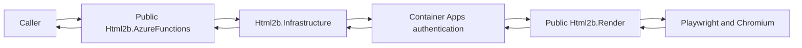
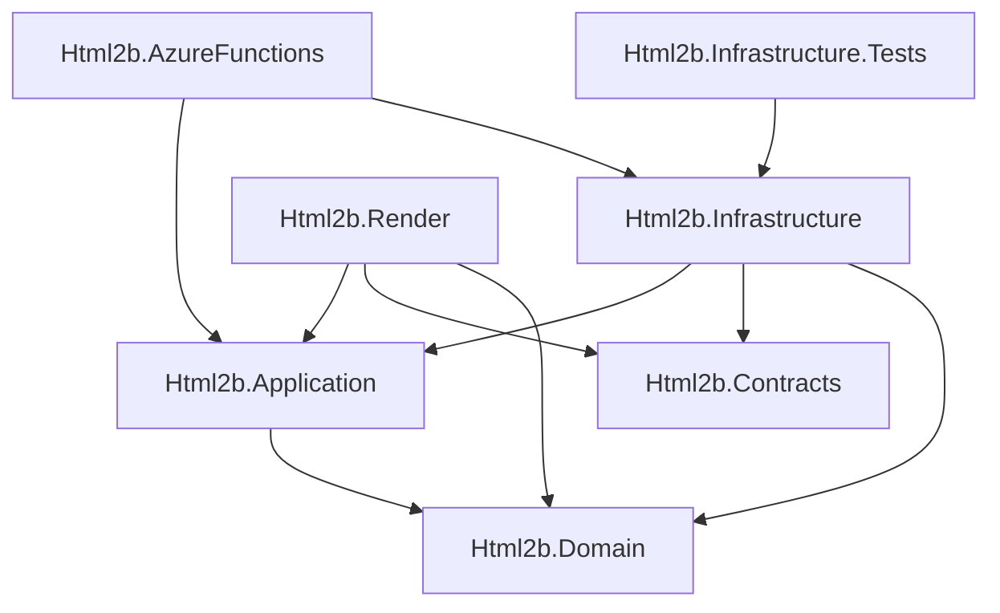

# Html2B API Architecture

This document describes the implemented .NET projects, runtime hosts, and
synchronous rendering flow.

## System Overview

Html2B runs two hosts:

- `Html2b.AzureFunctions` receives health and render requests on a public HTTPS
  hostname. Process liveness is anonymous; readiness and rendering require a
  Function key.
- `Html2b.Render` owns the HTML document, Chromium process, and output capture.
  Its Azure hostname is public and protected by Container Apps authentication.

The Functions host reaches Render through an Infrastructure-owned HTTP client.
For remote HTTPS requests, Infrastructure obtains a Microsoft Entra access
token with the Function host's system-assigned managed identity. Container Apps
validates the token audience and permits only that Function identity. The
complete file response is buffered before it is returned to the caller.


```mermaid
flowchart LR
    Caller["Caller"] --> Functions["Public Html2b.AzureFunctions"]
    Functions --> Infrastructure["Html2b.Infrastructure"]
    Infrastructure --> Auth["Container Apps authentication"]
    Auth --> Render["Public Html2b.Render"]
    Render --> Chromium["Playwright and Chromium"]
    Chromium --> Render
    Render --> Auth
    Auth --> Infrastructure
    Infrastructure --> Functions
    Functions --> Caller
```

## Repository Layout

```text
src/api/
  Html2b.slnx
  Html2b.AzureFunctions/
  Html2b.Application/
  Html2b.Contracts/
  Html2b.Domain/
  Html2b.Infrastructure/
  Html2b.Render/
  Test/
    Html2b.Infrastructure.Tests/

bicep/
  main.bicep
  environments/
  modules/
```

The solution contains six production projects and one test project.

## Project Responsibilities

| Project | Implemented responsibility |
| --- | --- |
| `Html2b.AzureFunctions` | Hosts anonymous process liveness plus Function-authorized readiness and render triggers, validates the requested format, and maps render failures to HTTP responses. |
| `Html2b.Application` | Defines the render engine, render gateway, and readiness boundaries, plus the rendered-file result and gateway exception. |
| `Html2b.Contracts` | Defines the versioned format request sent from the Functions-side HTTP client to Render. |
| `Html2b.Domain` | Defines the supported render formats and their parsing rules. |
| `Html2b.Infrastructure` | Validates Render service configuration, acquires the remote Render access token, registers the HTTP client, checks readiness, and relays bounded render responses. |
| `Html2b.Render` | Hosts health and render endpoints, owns the built-in HTML, manages Chromium, and creates PNG, JPEG, and PDF output. |
| `Html2b.Infrastructure.Tests` | Verifies Render configuration, managed-identity authentication, dependency registration, readiness, cancellation, and gateway failure handling. |

## Project Dependencies

An arrow means that the source project has a project reference to the
destination project.


```mermaid
flowchart TD
    Functions["Html2b.AzureFunctions"] --> Application["Html2b.Application"]
    Functions --> Infrastructure["Html2b.Infrastructure"]

    Infrastructure --> Application
    Infrastructure --> Contracts["Html2b.Contracts"]
    Infrastructure --> Domain["Html2b.Domain"]

    Render["Html2b.Render"] --> Application
    Render --> Contracts
    Render --> Domain

    Application --> Domain

    InfrastructureTests["Html2b.Infrastructure.Tests"] --> Infrastructure
```

`Html2b.Domain` and `Html2b.Contracts` have no project references. The two
runtime hosts do not reference each other. The test project references
`Html2b.Infrastructure`.

## Authentication Boundaries

- Azure Functions enforces Function authorization before invoking the
  readiness and render triggers. Process liveness remains anonymous.
- Infrastructure sends no token for loopback HTTP. For HTTPS, it enforces the
  configured origin and requests
  `api://<render-api-client-id>/.default` with the Function host's
  system-assigned identity.
- Container Apps authentication requires HTTPS, validates the version 2 tenant
  issuer and configured audience, permits the configured Function principal,
  and has no excluded paths.
- Render's user-assigned identity and registry role are used to pull its
  container image. They do not authorize Function-to-Render HTTP requests.

## Render Request Flow

1. The Functions host rejects a render request that does not provide an
   accepted Function key.
2. The Functions route parses the format value as PNG, JPEG, or PDF.
3. Infrastructure verifies that the request targets the configured Render
   origin.
4. For HTTPS, Infrastructure requests
   `api://<render-api-client-id>/.default` with the Function host's
   system-assigned managed identity and adds the resulting bearer token.
5. Container Apps validates the token and the configured Function identity
   before the request reaches Render.
6. Infrastructure sends the format to Render as a versioned JSON request.
7. Render passes its built-in HTML and the parsed format to the hosted
   Chromium renderer.
8. The renderer permits one active render, creates a browser context and page,
   and captures the output.
9. Render returns the content type, attachment metadata, and file bytes.
10. Infrastructure buffers at most 16 MiB and returns the completed file to the
   Functions host.
11. The Functions host returns the file response to the caller.

The Functions-to-Render call has a 75-second timeout. Readiness checks have a
2-second timeout.

## Chromium Lifecycle

`Html2b.Render` creates one Playwright-managed Chromium process when the host
starts. Readiness is reported only while that process is connected. Each
render uses a new browser context and page. The host closes Chromium during
shutdown.

## Runtime Configuration

The Functions host obtains the Render base URL and audience from configuration.
Tracked environment parameters supply the non-secret Render API client ID, and
Bicep derives the audience as `api://<render-api-client-id>`.
Loopback HTTP requires an empty audience and remains token-free. HTTPS requires
an audience in the form `api://<render-api-client-id>`; other HTTP origins are
rejected. Local configuration and startup commands are documented in
[Local development](../development/local-development.md).

## Deployment Boundary

The Azure development environment runs the Functions and Render projects as
separate hosts. Bicep under `bicep/` defines their infrastructure and passes the
Render service URL and audience to the Functions host. It also owns the
Function system-assigned identity and the Container Apps authentication policy.

Both hosts have public HTTPS hostnames. Function keys protect the
Render-consuming Functions routes, and Microsoft Entra identity protects
Render. These controls restrict callers but do not make either host
network-private.

The operator-driven release process is documented in
[Azure development deployment](../operations/azure-dev-deployment.md).
