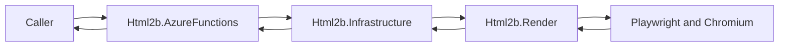
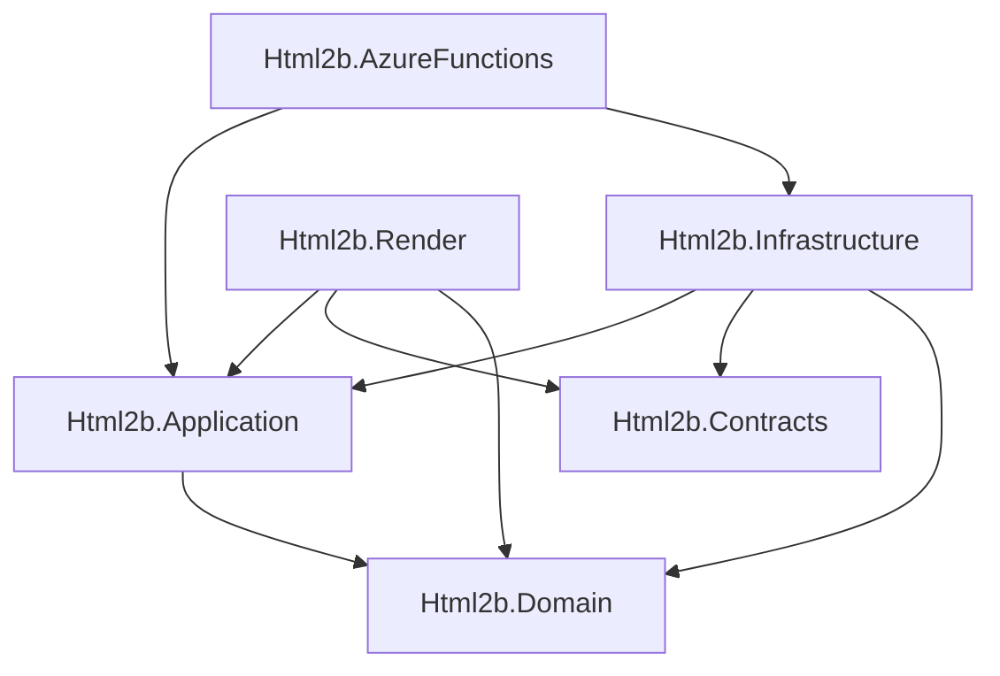

# Html2B API Architecture

This document describes the implemented .NET projects, runtime hosts, and
synchronous rendering flow.

## System Overview

Html2B runs two hosts:

- `Html2b.AzureFunctions` receives health and render requests.
- `Html2b.Render` owns the HTML document, Chromium process, and output capture.

The Functions host reaches Render through an Infrastructure-owned HTTP client.
The complete file response is buffered before it is returned to the caller.


```mermaid
flowchart LR
    Caller["Caller"] --> Functions["Html2b.AzureFunctions"]
    Functions --> Infrastructure["Html2b.Infrastructure"]
    Infrastructure --> Render["Html2b.Render"]
    Render --> Chromium["Playwright and Chromium"]
    Chromium --> Render
    Render --> Infrastructure
    Infrastructure --> Functions
    Functions --> Caller
```

## Repository Layout

```text
src/api/
  Html2b.slnx
  Html2b.AzureFunctions/
  Html2b.Application/
  Html2b.Contracts/
  Html2b.Domain/
  Html2b.Infrastructure/
  Html2b.Render/

bicep/
  main.bicep
  bootstrap.bicep
  environments/
  modules/
```

The solution contains six production projects.

## Project Responsibilities

| Project | Implemented responsibility |
| --- | --- |
| `Html2b.AzureFunctions` | Hosts the health and render HTTP triggers, validates the requested format, and maps render failures to HTTP responses. |
| `Html2b.Application` | Defines the render engine, render gateway, and readiness boundaries, plus the rendered-file result and gateway exception. |
| `Html2b.Contracts` | Defines the versioned format request sent from the Functions-side HTTP client to Render. |
| `Html2b.Domain` | Defines the supported render formats and their parsing rules. |
| `Html2b.Infrastructure` | Validates Render service configuration, registers the HTTP client, checks readiness, and relays bounded render responses. |
| `Html2b.Render` | Hosts health and render endpoints, owns the built-in HTML, manages Chromium, and creates PNG, JPEG, and PDF output. |

## Project Dependencies

An arrow means that the source project has a project reference to the
destination project.


```mermaid
flowchart TD
    Functions["Html2b.AzureFunctions"] --> Application["Html2b.Application"]
    Functions --> Infrastructure["Html2b.Infrastructure"]

    Infrastructure --> Application
    Infrastructure --> Contracts["Html2b.Contracts"]
    Infrastructure --> Domain["Html2b.Domain"]

    Render["Html2b.Render"] --> Application
    Render --> Contracts
    Render --> Domain

    Application --> Domain
```

`Html2b.Domain` and `Html2b.Contracts` have no project references. The two
runtime hosts do not reference each other.

## Render Request Flow

1. The Functions route parses the format value as PNG, JPEG, or PDF.
2. Infrastructure sends the format to Render as a versioned JSON request.
3. Render passes its built-in HTML and the parsed format to the hosted
   Chromium renderer.
4. The renderer permits one active render, creates a browser context and page,
   and captures the output.
5. Render returns the content type, attachment metadata, and file bytes.
6. Infrastructure buffers at most 16 MiB and returns the completed file to the
   Functions host.
7. The Functions host returns the file response to the caller.

The Functions-to-Render call has a 75-second timeout. Readiness checks have a
2-second timeout.

## Chromium Lifecycle

`Html2b.Render` creates one Playwright-managed Chromium process when the host
starts. Readiness is reported only while that process is connected. Each
render uses a new browser context and page. The host closes Chromium during
shutdown.

## Runtime Configuration

The Functions host obtains the Render base URL from configuration and validates
that it is an absolute HTTP or HTTPS URI during startup. Local configuration
and startup commands are documented in
[Local development](../development/local-development.md).

## Deployment Boundary

The Azure development environment runs the Functions and Render projects as
separate hosts. Bicep under `bicep/` defines their infrastructure and passes the
Render service URL to the Functions host.

The operator-driven release process is documented in
[Azure development deployment](../operations/azure-dev-deployment.md).
